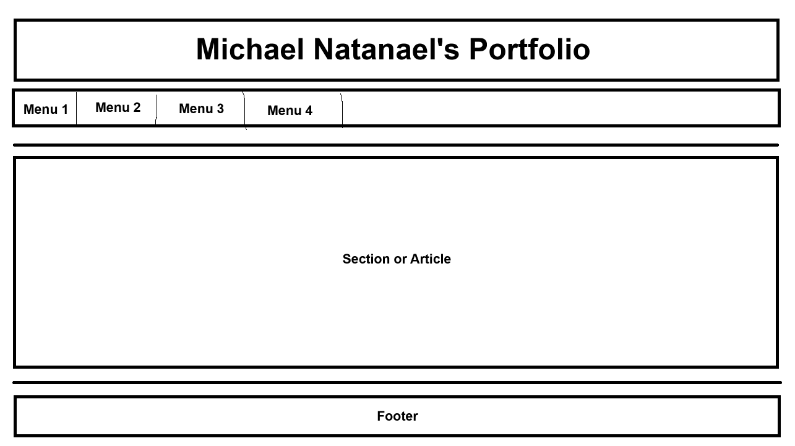
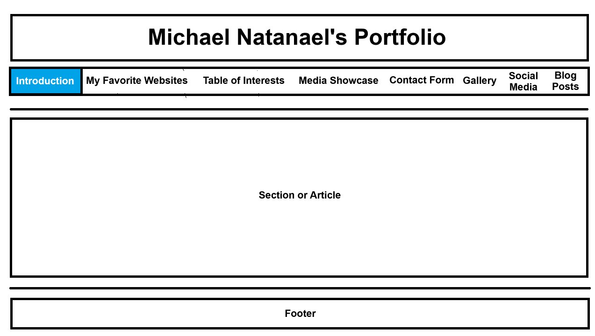
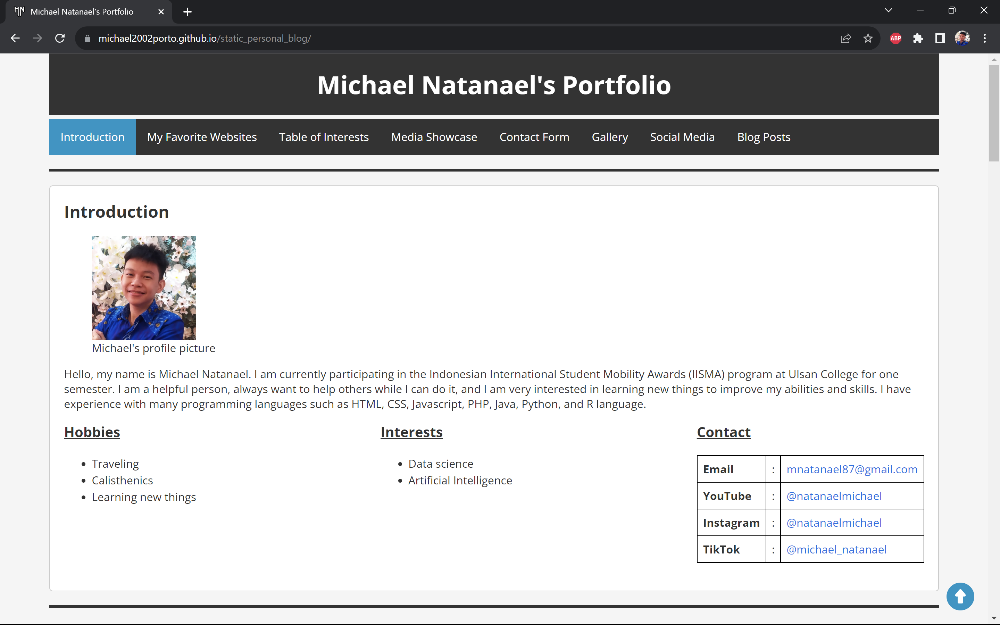

# Michael Natanael's Portfolio
Welcome to Michael Natanael's Portfolio! This is a simple HTML portfolio website that showcases my profile, favorite websites, interests, and more.

## Ideation and Design

### Sketches
During the initial ideation phase, I explored various design concepts for my project. I created rough sketches to visualize different layouts, elements, and user interfaces. These sketches helped me brainstorm ideas and evaluate their feasibility.

### Mockups
Based on the sketches, we developed digital mockups using design software. These mockups provided a more detailed representation of our project's user interface. We iterated on these mockups to refine the design.

### Final Design Choice
After careful consideration and feedback from the team, I chose the following design as the final choice for my project.

## Fonts and Colors

### Font Choice
I selected the "'Open Sans', Arial, sans-serif" font for my project. This font offers excellent readability and a clean, modern look, making it suitable for both headings and body text. Its versatility ensures a consistent and professional appearance.

### Color Palette
My color palette consists of the following primary colors:
:root {
    --primary-color: #0073e6; /* Define primary color using a CSS variable */
    --secondary-color: #333; /* Define secondary color using a CSS variable */
    --text-color: #333; /* Define text color using a CSS variable */
    --background-color: #f5f5f5; /* Define background color using a CSS variable */
}
These colors were chosen for their compatibility, accessibility, and aesthetics.

## Approach and Challenges
My approach to development was based on an agile methodology, allowing us to adapt to changing requirements. We encountered several challenges during the project:
1. Cross-Browser Compatibility: Ensuring that my project worked seamlessly across various browsers and devices required extensive testing and debugging.
2. Responsive Design: Adapting the user interface to different screen sizes and resolutions presented challenges in maintaining a consistent and user-friendly experience.

## Extra Features
In addition to the core functionality, I added some extra features to enhance the user experience:
- Gallery Section: to showcase my design work and projects.
- Social Media Integration: Users can share content easily on various social media platforms.

## Feedback and Impact
Feedback received during the project's development was invaluable. It helped identify areas for improvement, leading to a more polished final product. The impact of this project is a functional and visually appealing personal blog, providing a platform to share my interests and work with others.

Feedback Impact:
- Improved overall user experience.
- Enhanced the clarity of user instructions.
- User feedback and iterative design were instrumental in delivering a product that meets user expectations and provides a seamless experience.

## Table of Contents
- [Introduction](index.html#introduction)
- [My Favorite Websites](index.html#my-favorite-websites)
- [Table of Interests](index.html#table-of-interests)
- [Media Showcase](index.html#media-showcase)
- [Contact Form](index.html#contact-form)
- [Gallery](gallery.html)
- [Social Media](social_media.html)

## Project Overview (Index)
This portfolio website was created by Michael Natanael to introduce himself and showcase his skills and interests. Here's a brief overview of what you'll find in this repository:
- **HTML & CSS:** The website is built using HTML and styled with CSS. It's designed to be responsive and visually appealing.
- **Navigation:** The site includes a navigation bar that allows you to quickly jump to different sections.
- **Content:** You can learn about Michael's introduction, hobbies, interests, favorite websites, and more.

## Features (Index)
- Detailed introduction of Michael Natanael.
- A list of Michael's favorite websites with descriptions and links.
- Information about Michael's hobbies and interests.
- Contact information, including email and social media profiles.

## Gallery
This HTML file serves as the gallery section of Michael Natanael's personal website. It contains a collection of images with captions, showcasing his design work and projects.

## Features (Gallery)
- Responsive Design: The gallery is designed to adapt to different screen sizes for an optimal viewing experience.
- Navigation: Users can easily navigate to other sections of the website using the top navigation bar.
- Copyright Information: The footer contains copyright information for the content.

## Social Media
This page serves as a central hub to connect with Michael on different social media platforms.

## Features (Social Media)
- Clean and straightforward design.
- Quick access to various social media profiles.
- Utilizes Font Awesome icons for social media buttons.
- Responsive layout for different screen sizes.

Thank you for reviewing my project documentation. If you have any further questions or suggestions, please feel free to reach out me.